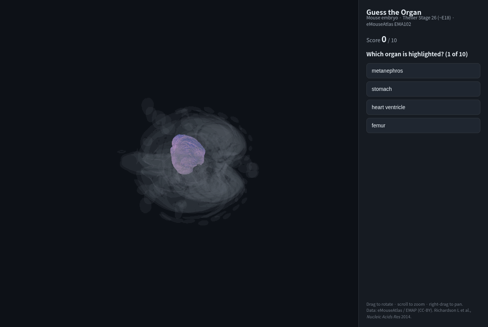

# Guess the Organ — Mouse Embryo 3D Demo

An interactive "guess the organ" game built on **eMouseAtlas (EMA / EMAP)** 3D anatomy
data. A mouse embryo (Theiler Stage 26, ~E18) is shown in 3D; one organ glows through the
faint embryo body and the player picks its name from four choices.

**Live demo:** https://yuehhua.github.io/mouse-embryo-vis/



## How it works

Two layers:

1. **Offline build (Python, one-time):** `scripts/` converts the EMA indexed anatomy
   volume (NIfTI) into small, coloured per-organ meshes packed as one Draco-ready GLB plus
   a JSON manifest. This is a build tool — it never runs in the browser.
2. **The website (JavaScript / Three.js):** `docs/` is a static site (no build step) that
   loads the GLB and runs the quiz. Served by GitHub Pages from the `docs/` folder.

The mesh reconstruction — including the **cubic-spline shape-based interpolation between
histological sections** that removes the "sliced" terracing — is documented in
[`METHODS.md`](METHODS.md).

## Run locally

```bash
cd docs
python3 -m http.server 8765
# open http://localhost:8765/
```

## Rebuild the meshes (optional)

The raw EMA data is not committed (multi-GB). To regenerate `docs/data/ts26.glb`:

```bash
python -m venv .venv && . .venv/bin/activate
pip install numpy nibabel trimesh scikit-image fast-simplification

# Download the TS26 model (EMA102) from Edinburgh DataShare collection 10283/2805
#   item handle 10283/2841 -> TS26_EMA102_anatomy.nii + _anatomy.txt
python scripts/convert_ema.py \
  --nii data/ema/raw/TS26_EMA102/TS26_EMA102_anatomy.nii \
  --labels data/ema/raw/TS26_EMA102/TS26_EMA102_anatomy.txt \
  --stage TS26 --out docs/data --max-faces 20000
```

## Data source & citation

3D models and anatomy delineations from **eMouseAtlas / EMAP** (CC-BY).
EMAP eMouse Atlas Project (http://www.emouseatlas.org). Please cite:
Richardson L, Venkataraman S, Stevenson P, et al. *EMAGE mouse embryo spatial gene
expression database: 2014 update.* Nucleic Acids Res. 2014;42(D1):D835-44.
